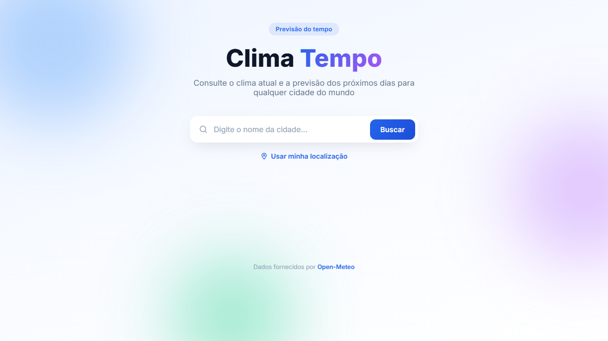
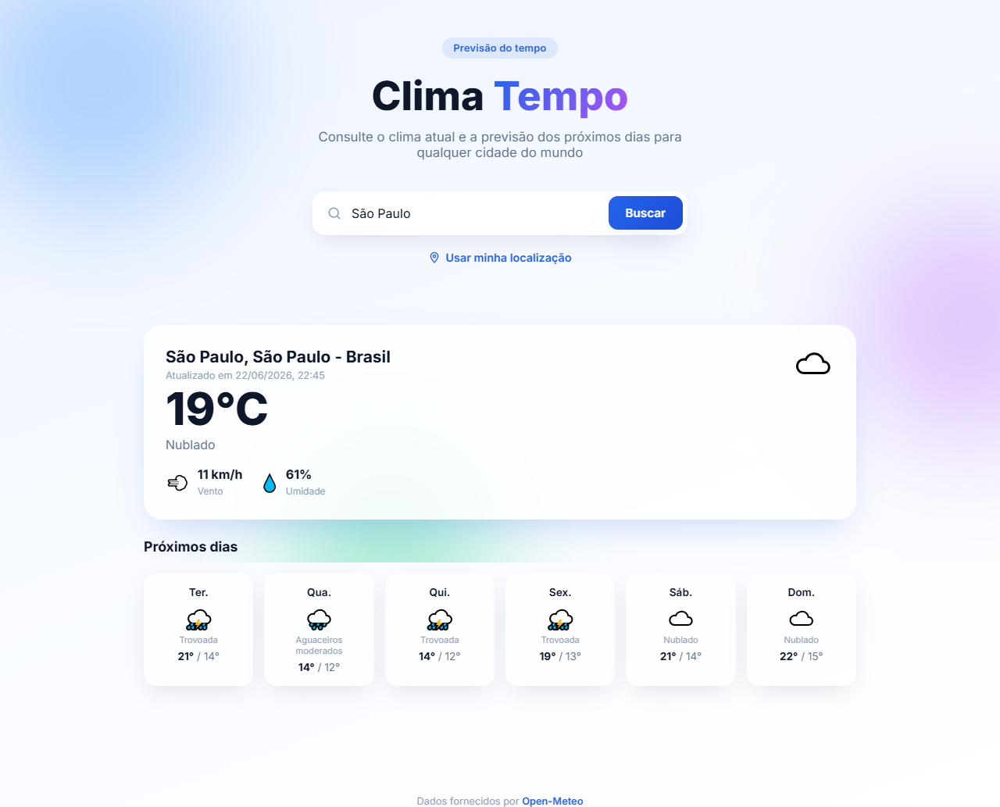

# ⛅ Clima Tempo

Site para consultar o clima atual e a previsão dos próximos dias de qualquer cidade do mundo — sem cadastro, sem chave de API e sem build step. Basta abrir o `index.html`.



## Funcionalidades

- Busca por nome de cidade (geocodificação automática).
- Detecção da localização atual via geolocalização do navegador.
- Clima atual: temperatura, descrição, vento e umidade.
- Previsão para os próximos dias, com ícone e temperaturas máxima/mínima.
- Totalmente responsivo (mobile e desktop).



## Tecnologias

- HTML5, CSS3 e JavaScript puro (sem frameworks, sem dependências, sem etapa de build).
- [Open-Meteo](https://open-meteo.com) para geocodificação e previsão do tempo — API pública e gratuita, sem necessidade de chave de API.

## Como rodar

Não há instalação nem build. Para usar localmente:

1. Baixe ou clone este repositório.
2. Abra o arquivo `index.html` diretamente no navegador (duplo clique).

Alternativamente, sirva a pasta com qualquer servidor estático (opcional, útil para evitar peculiaridades de `file://` em alguns navegadores):

```bash
npx serve .
# ou
python -m http.server 8000
```

## Estrutura

```
clima-tempo/
├── index.html              Estrutura da página
├── assets/
│   ├── css/global/style.css   Estilos (layout, cores, responsividade)
│   └── js/app.js              Busca de cidade, geolocalização e renderização
└── docs/                   Screenshots usados neste README
```

## Segurança e privacidade

- Não há chaves de API, tokens ou segredos no código — a API do Open-Meteo é pública e não exige autenticação.
- Toda a busca é feita diretamente do navegador do usuário para a API; nenhum dado é enviado a servidores próprios.
- O nome de cidade digitado é tratado com `encodeURIComponent` antes de compor a URL da requisição, e todo conteúdo dinâmico é inserido via `textContent` (não `innerHTML`) onde há entrada do usuário, evitando XSS.
- A geolocalização só é usada após permissão explícita do navegador e nunca é armazenada.

## Licença

Distribuído sob a licença [MIT](LICENSE).

Dados de clima fornecidos por [Open-Meteo](https://open-meteo.com).
